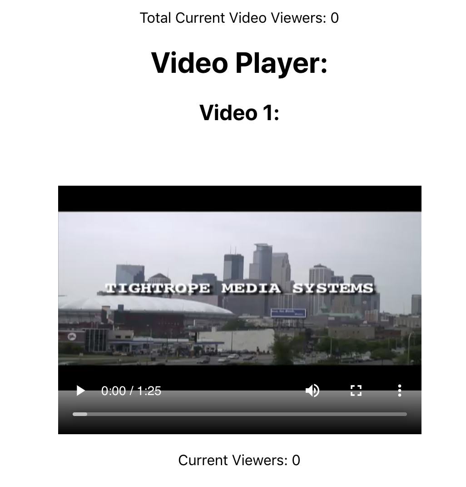

## Screenweave Exercise

This project includes a dashboard that allows users to view videos along with real-time data of total viewers and viewers per video. Data on viewers is enabled by [socket.io](https://socket.io/).

## Screenshot

## Prerequisites
- [socket.io](https://socket.io/)
- [Express](https://expressjs.com/)
- [Nodemon](https://nodemon.io/)

## Installation
1. Run an `npm install`
2. Run an `npm run server`
3. Run an `npm run client`
4. The previous command should prompt a browser window to open.

